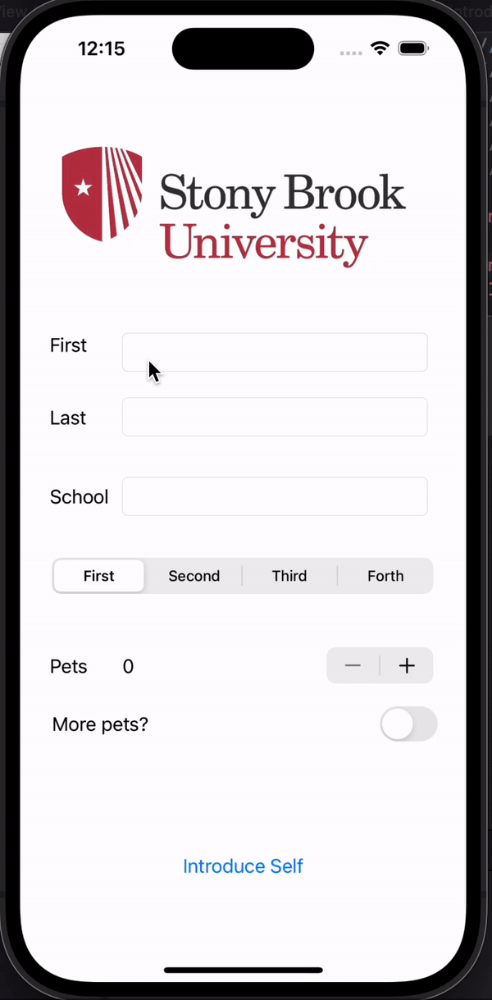

## IOS102 Pre-work: Introduce Yourself

### App Description

This is the prework for iOS Intermediate Development. This functional app shows the basics of navigating Xcode and Swift. It allows users to introduce themselves by accepting user inputs in various forms, such as switches, text fields, segmented controls, and more. 

### App Walk-though

 

### Required Features

- [x] 1. App displays an image of a school's logo
- [x] 2. App has three textfields for first, last, and school names
- [x] 3. App has a segmented control that changes student year
- [x] 4. Number of pet matches label is increased/decreased by stepper
- [x] 5. Switch makes a statement about wanting more pets or not(true/false) 
- [x] 6. Introduce yourself button shows alert box with an introduciton and dismiss button

